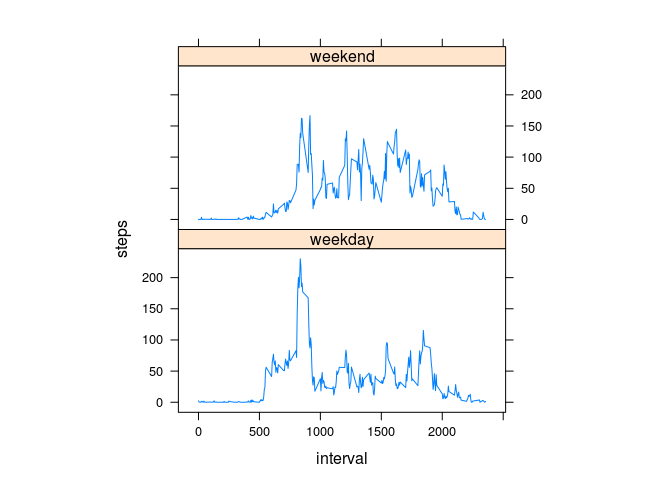

# Reproducible Research: Peer Assessment 1


## Loading and preprocessing the data

- Reading the data

```r
data <- read.csv("activity.csv")
```

- Processing the data

```r
steps <- aggregate(steps~date, data=data, sum, na.rm=TRUE)
stepsInterval <- aggregate(steps~interval, data=data, mean, na.rm=TRUE)
```

## What is mean total number of steps taken per day?

- Histogram

```r
hist(steps$steps)
```

 

- Mean & median

```r
mean(steps$steps)
```

```
## [1] 10766.19
```

```r
median(steps$steps)
```

```
## [1] 10765
```

## What is the average daily activity pattern?

- Average number of steps by interval

```r
plot(steps~interval,data=stepsInterval,type="l")
```

 

- Which 5-minute interval, on average across all the days in the dataset, contains the maximum number of steps?

```r
stepsInterval[which.max(stepsInterval$steps),]$interval
```

```
## [1] 835
```

## Imputing missing values

- Total number of missing values

```r
sum(is.na(data$steps))
```

```
## [1] 2304
```

- My strategy was to use the mean of the specific interval for the missing values
    1. I created a function to quickly get the average steps in a given interval

```r
stepsByInterval <- function(interval) {
  stepsInterval[stepsInterval$interval == interval, ]$steps
}
```

- Creating a new dataset

```r
predictedData <- data
for (i in 1:nrow(predictedData)) {
  if (is.na(predictedData[i, ]$steps)) {
    predictedData[i, ]$steps <- stepsByInterval(predictedData[i, ]$interval)
  }
}
```

- Make a histogram of the total number of steps taken each day and Calculate and report the mean and median total number of steps taken per day.

```r
predictedSteps <- aggregate(steps~date, data=predictedData, sum)
hist(predictedSteps$steps)
```

 

```r
mean(predictedSteps$steps)
```

```
## [1] 10766.19
```

```r
median(predictedSteps$steps)
```

```
## [1] 10766.19
```

- Do these values differ from the estimates from the first part of the assignment?  
The're basically the same, because we used the mean of the intervals which could not change the previous *mean*.
The *median* changed a bit, but this change is not significant.

## Are there differences in activity patterns between weekdays and weekends?

- Create a new factor variable in the dataset with two levels -- "weekday" and "weekend" indicating whether a given date is a weekday or weekend day.

```r
predictedData$day <- ifelse(as.POSIXlt(predictedData$date)$wday%%6==0, "weekend", "weekday")
predictedData$day <- factor(predictedData$day, levels=c("weekday", "weekend"))
```

- Average number of steps by interval during weekdays and the weekend

```r
predictedStepsInterval <- aggregate(steps~interval + day, data=predictedData, mean)
library(lattice)
xyplot(steps~interval | factor(day), data=predictedStepsInterval, aspect=1/2, type="l")
```

 
